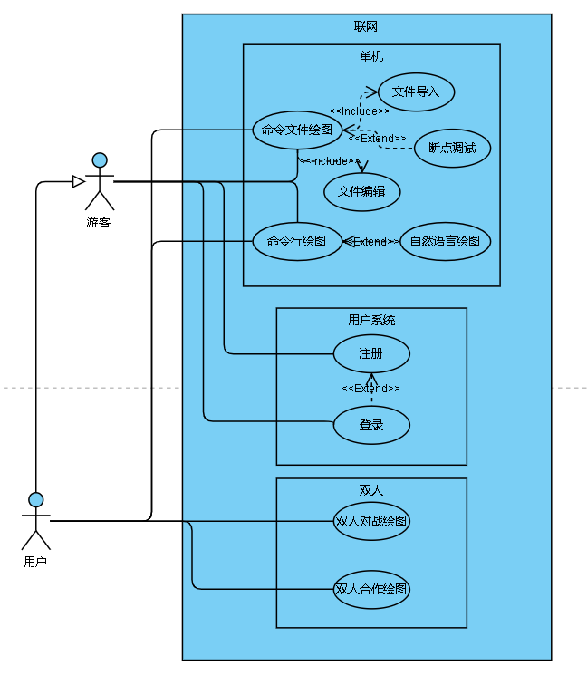

# Use-case Model 2.0

> ✍ Group 13 | 📅 2020-11-02

1. 绘制方便及简洁性起见，用例图中忽略了错误处理部分

2. 使用的绘制工具

    > 🛠 在线绘图网站 [Visual Paradigm Online](https://online.visual-paradigm.com/drive/#diagramlist:proj=0&new=UseCaseDiagram)

3. 绘图的工程文件见 [use-case.vpd](./use-case.vpd)

## 用例图

整体上包含三个模块：

- 单机模式
- 用户系统
- 双人模式

其中用户系统和双人模式需要在联网下才能使用，单机模式在联网与不联网下均能使用，所以将单机模式包含在联网下画出

## 单机模式

在单机模式下，用户可以有两种使用方法

1. 命令行模式

    - 每一条指令输入后，经过解析器解析，确认合乎语法规范后，交付给执行器将结果绘制在画布上
    - 输入指令可以是直接键入命令行，或者使用自然语言通过语音方式输入（进阶需求）

2. 命令文件模式

   - 文件可以自行在编辑器上编写或者直接将文件导入编辑器
   - 通过丰富的指令组合，解释器确认在合乎语法规范后，绘制出丰富多彩的图案
   - 还可设置断点进行调试，分步运行

## 联网模式

联网模式下主要有两种使用方法，即双人协作与双人对战

### 用户系统

若想联网需要登录，用户需要拥有一个账户

- 游客可以选择填写注册信息注册新账户，用于联网模式。注册表单包含用户名，邮箱/电话号码，密码等信息
- 游客若已有账户，填写账号及密码，经后台验证成功后方可登录
- 若登录时提示没有账户则令游客前往注册账户

### 匹配机制

在联网游戏之前，需要进行匹配寻找一起玩耍的用户

- 已登录用户发送匹配请求，由后台服务器端自动匹配

- 匹配到后，双方需要在有限时间内（如30秒）确认

- 双方均确认后建立连接，即可进行联网游戏

- 若规定时间内尚有用户未确认，则本次匹配失效

### 协作模式

1. 网上双人单海龟协同绘图
    已经匹配的两名用户，通过轮流发送指令控制单个海龟绘图，每人需要在固定的操作时间限制内发送指令，否则海龟的控制转移到另一用户手中
2. 网上双人双海龟协同绘图
    已经匹配的两名用户，各自发送指令控制自己的海龟绘图，双方可以自由协调沟通，共同合作完成绘图

### 对战模式

**网上双人双海龟绘图对战**
已经匹配的两名用户，各自发送指令控制自己的海龟绘图，在规定时间结束后，经由评分模块通过一定的评分机制决出胜者
